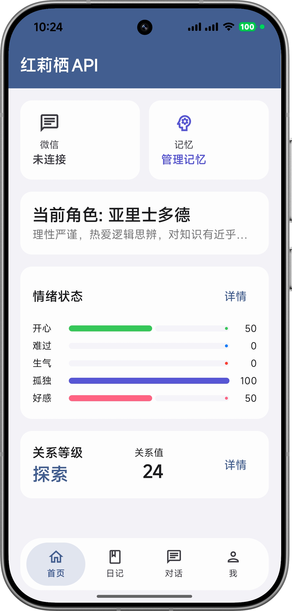
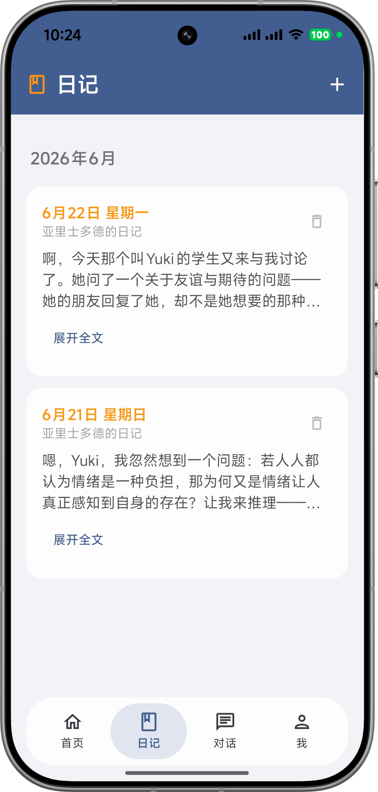
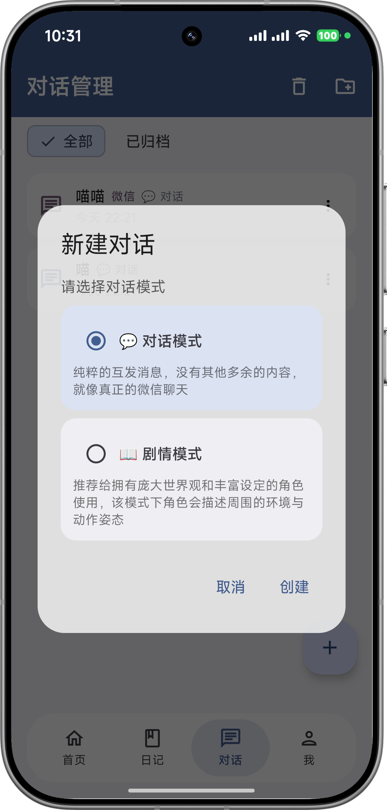
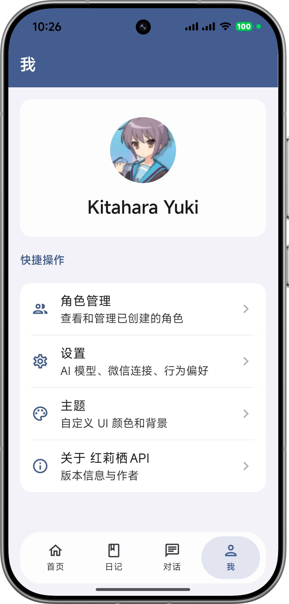

# KurisuAPI / 红莉栖API

[](LICENSE)
[](https://kotlinlang.org)
[](https://developer.android.com)
[](https://developer.android.com/build)
[](https://developer.android.com/compose)

[中文](#中文) | [English](#english)

<p align="center">
  
  
  
  
</p>

---

## 中文

这是一款 AI 情感陪伴 Android 应用，支持微信机器人、角色扮演与情感记忆系统。开箱即用。在记忆系统与提示词工程当中有大量有价值的内容（自认为）还有部分硬编码对于Ai聊天风格当中。其中剧情模式是这个项目的特色，可以体验一下。

这个项目最开始源于命运石之门当中的牧濑红莉栖的AI，我有一个乌托邦般的美好幻想，但是现实毕竟不是乌托邦。
所以，这个项目是一个半成品。因为各种原因我可能放弃继续制作（目前还在继续更新与修复bug），我在这上面也付出了不少，不希望看到她埋没在仓库里，所以我决定开源，有能力也有兴趣的开发者，可以将她完善。

这个项目90%的内容都为Vibe coding，所以可能有些不合理的地方。

这个项目目前还没有英文版本，有能力的开发者可以尝试进行英译

### 功能

- **多 AI 提供商 / Multi-Provider** — 支持 Anthropic (Claude)、Gemini、OpenAI 兼容接口，可在应用内切换
- **角色扮演 / Role-Play** — 自定义 AI 角色的人设、性格、说话风格
- **长期记忆 / Long-Term Memory** — AI 会记住你们聊过的重要内容，越聊越懂你
- **情感引擎 / Emotion Engine** — AI 会根据对话内容产生情绪反应
- **关系系统 / Relationship System** — AI 与你的关系会随着互动逐渐变化
- **日记功能 / Diary** — 自动生成日记，记录与 AI 的互动
- **微信机器人 / WeChat Bot** — 可接入微信，让 AI 替你回复消息
- **向量搜索 / Vector Search** — 基于语义的记忆检索
- **液态玻璃 UI / Liquid Glass UI** — iOS 风格液态玻璃界面（其实只有输入框）

### 技术栈 / Tech Stack

| 分类 Category | 技术 Tech |
|---------------|-----------|
| 语言 Language | Kotlin 2.x |
| UI | Jetpack Compose + Material 3 |
| DI | Hilt |
| 数据库 Database | Room + SQLite-Vector (向量搜索 Vector Search) |
| 网络 Network | Retrofit + OkHttp |
| 构建 Build | Gradle + KSP |

### 项目结构 / Project Structure

```
com.kurisuapi/
├── data/           # 数据层 Data Layer：API、DAO、Entity、Repository
├── di/             # Hilt 依赖注入模块 Dependency Injection
├── domain/         # 业务逻辑 Domain：AI 引擎、情感引擎、记忆系统、微信桥接
├── service/        # Android 服务 Services：启动、日记定时、微信机器人
├── ui/             # 界面 UI：屏幕、组件、主题、ViewModel
└── util/           # 工具类 Utilities
```

### 构建 / Build

1. 用 Android Studio 打开项目 / Open with Android Studio
2. 创建 `local.properties`，填入签名信息（或跳过签名用 debug 构建）：
   ```properties
   sdk.dir=/path/to/Android/sdk
   RELEASE_STORE_PASSWORD=your_password
   RELEASE_KEY_ALIAS=kurisuapi
   RELEASE_KEY_PASSWORD=your_password
   ```
3. 生成自己的 `release.keystore`（或修改 `build.gradle.kts` 去掉 release 签名）
4. `./gradlew assembleDebug`

或者直接用 Android Studio 点运行 / Or just click Run in Android Studio.

### 许可证 / License

本项目使用 **GNU General Public License v3.0 (GPL 3.0)**。详见 [LICENSE](LICENSE) 文件。

This project is licensed under **GPL 3.0**. See [LICENSE](LICENSE).

---

## English

This is an AI‑powered emotional companion Android app, featuring WeChat bot integration, role‑play capabilities, and an emotional memory system. It’s ready to use out of the box. I believe the memory system and prompt engineering contain a great deal of valuable insight, though some parts of the AI chat logic are still hard‑coded.The story mode is a key feature of this project — feel free to give it a try.


This project originally started as an AI inspired by Makise Kurisu from Steins;Gate. I had a beautiful, utopian vision for it, but reality, after all, is no utopia. So the project remains a work in progress. Due to various reasons, I've reluctantly had to give up on continuing its development. I've put a lot of effort into it, and I don't want it to be buried in my repository. That's why I've decided to open-source it — so that any developer with the skills and interest can pick it up and improve it.

About 90% of this project was built through vibe coding, so there may be some rough edges and illogical parts.

The app does not yet have an English localization. If any developer is willing to help with translation, I would be extremely grateful.

### Features

- **Multi-Provider AI** — Anthropic (Claude), Gemini, OpenAI-compatible. Switch on the fly.
- **Role-Play** — Customize character personality, backstory, and speech style.
- **Long-Term Memory** — The AI remembers what matters from your conversations.
- **Emotion Engine** — The AI reacts emotionally to your messages.
- **Relationship System** — Your bond with the AI evolves through interaction.
- **Diary** — Auto-generated journal entries from your AI interactions.
- **WeChat Bot** — Connect to WeChat for auto-reply.
- **Vector Search** — Semantic memory retrieval.
- **Liquid Glass UI** — iOS-inspired frosted glass interface.

### Tech Stack

| Category | Tech |
|----------|------|
| Language | Kotlin 2.x |
| UI | Jetpack Compose + Material 3 |
| DI | Hilt |
| Database | Room + SQLite-Vector |
| Network | Retrofit + OkHttp |
| Build | Gradle + KSP |

### Project Structure

```
com.kurisuapi/
├── data/           # API, DAO, Entity, Repository
├── di/             # Hilt modules
├── domain/         # AI Engine, Emotion Engine, Memory, WeChat Bridge
├── service/        # Boot Receiver, Diary Worker, WeChat Bot Service
├── ui/             # Screens, Components, Theme, ViewModels
└── util/           # Utilities
```

### Build

Same as Chinese section above. Quick start: open with Android Studio and hit Run.

### License

**GPL 3.0**. See [LICENSE](LICENSE).
